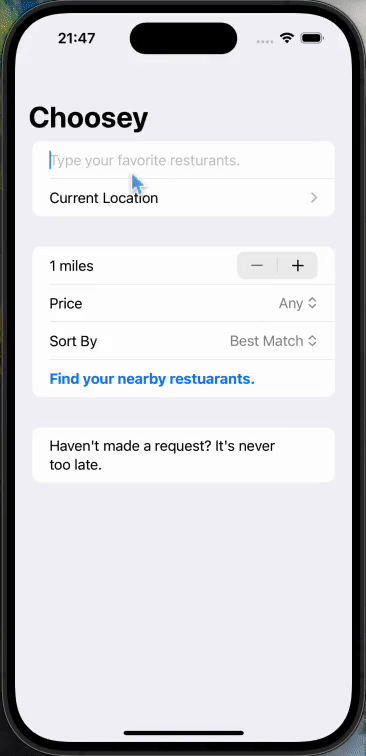

<table>
  <tr>
    <td>
      <h1>Choosey</h1>
      First Apprenticeship Project<be>
      (Can I put a copy of this repo to my public Github?)
    </td>
    <td>
      
      Generated by DALL·E 3
    </td>
  </tr>
</table>
<table>
  <tr>
    <th>Stage 0</th>
    <th>Stage 1</th>
    <th>Stage 2</th>
    <th>Stage 3</th>
    <th>Stage 3.5</th>
  </tr>
  <tr>
    <td></td>
    <td></td>
    <td></td>
    <td></td>
    <td></td>
  </tr>
</table>
